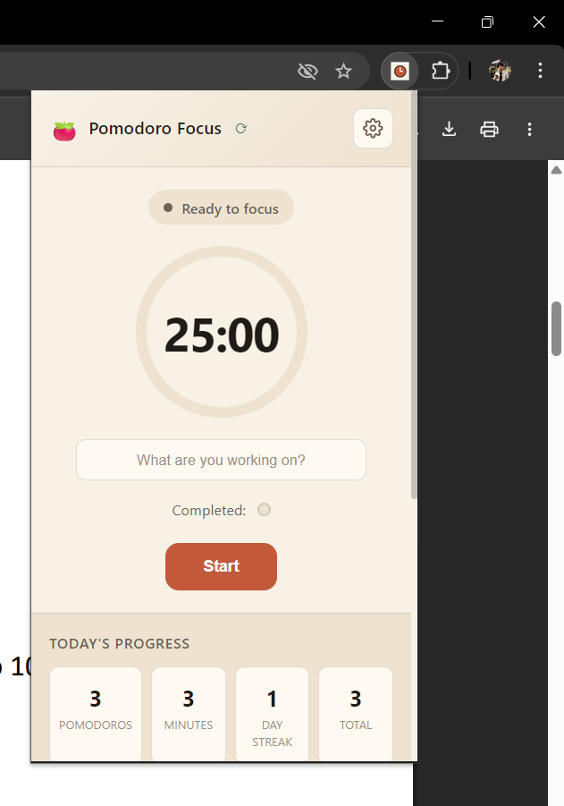
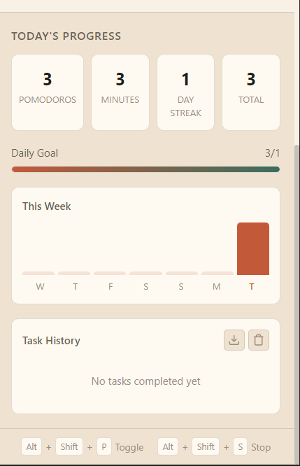
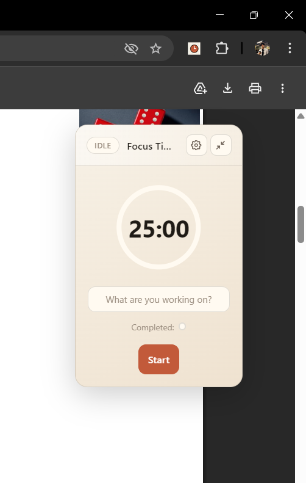
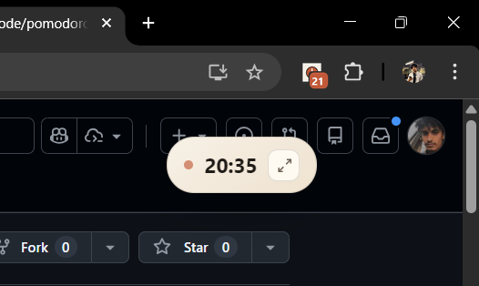
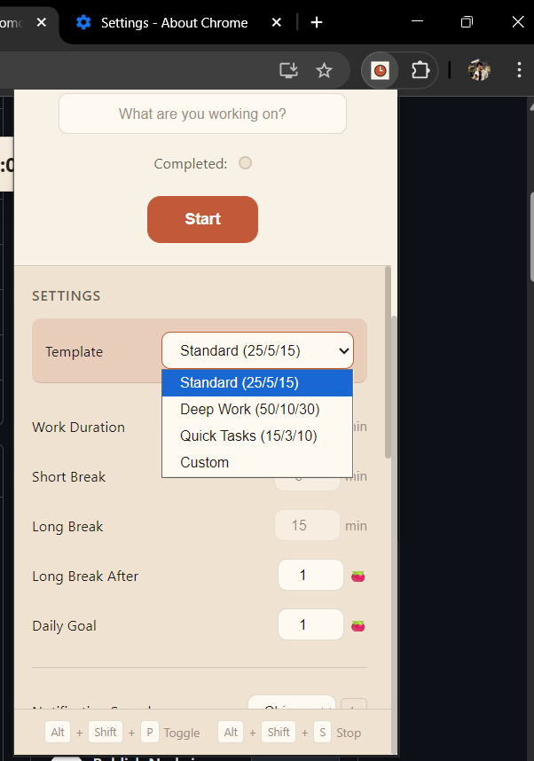
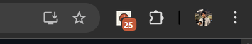
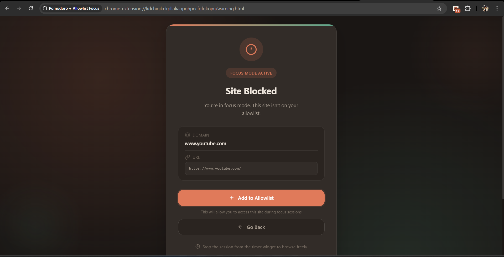

<div align="center">


# 🍅 Pomodoro Focus Extension

**A powerful Manifest V3 Chrome extension featuring a draggable Pomodoro timer overlay with website blocking, statistics tracking, and customizable settings.**

[](https://github.com)
[](https://developer.chrome.com/docs/extensions/mv3/)
[](LICENSE)
[](https://www.google.com/chrome/)

</div>

---

## 📸 Screenshots

<table>
  <tr>
    <td align="center">
      <br>
      <b>Popup Interface</b>
    </td>
    <td align="center">
      <br>
      <b>Statistics Dashboard</b>
    </td>
  </tr>
  <tr>
    <td align="center">
      <br>
      <b>Extended Floating Widget</b>
    </td>
    <td align="center">
      <br>
      <b>Minimized Capsule View</b>
    </td>
  </tr>
  <tr>
    <td align="center">
      <br>
      <b>Template Selection</b>
    </td>
    <td align="center">
      <br>
      <b>Badge Timer on Icon</b>
    </td>
  </tr>
  <tr>
    <td align="center" colspan="2">
      <br>
      <b>Website Block Warning</b>
    </td>
  </tr>
</table>

---

## ✨ Features

<details>
<summary><b>🕐 Timer & Productivity</b></summary>

- **Draggable Timer Widget** - Always-visible overlay on every page
- **Minimizable View** - Collapse to compact mode showing just the timer
- **Work/Break Cycling** - Automatic transitions between focus and rest periods
- **Long Breaks** - Extended breaks after completing multiple pomodoros
- **Task Labels** - Name what you're working on for each session
- **Skip Segment** - Jump to next work/break period when needed

</details>

<details>
<summary><b>🚫 Focus & Blocking</b></summary>

- **Allowlist Blocking** - Block all sites except those you allow during focus
- **Automatic Site Detection** - Current site auto-added when starting
- **Persistent Allowlist** - Optionally remember allowed sites between sessions
- **Beautiful Warning Page** - Clear UI when a blocked site is accessed

</details>

<details>
<summary><b>📈 Statistics & Tracking</b></summary>

- **Daily Progress** - Track pomodoros and focus minutes per day
- **Weekly Chart** - Visual overview of your week's productivity
- **Streak Counter** - See your consecutive active days
- **Daily Goals** - Set and track pomodoro targets
- **30-Day History** - Statistics retained for a full month
- **Task History** - View completed tasks with timestamps and export to JSON

</details>

<details>
<summary><b>🎨 Customization</b></summary>

- **Pomodoro Templates** - Quick presets: Standard (25/5/15), Deep Work (50/10/30), Quick Tasks (15/3/10)
- **Adjustable Durations** - Custom work, short break, and long break times
- **Auto-Start Options** - Automatically begin breaks or work sessions
- **Custom Sound Selection** - Choose from Chime, Bell, Digital, or Gentle notification sounds
- **Desktop Notifications** - System notifications for segment changes
- **Dark/Light Theme** - Match your preference or system setting
- **Strict Mode** - Prevent stopping during work (optional)
- **Sync Across Devices** - Settings sync automatically via Chrome account

</details>

### ⌨️ Keyboard Shortcuts

| Shortcut | Action |
|:--------:|:------:|
| `Ctrl+Shift+Y` | Toggle timer (Start/Pause/Resume) |
| `Ctrl+Shift+U` | Stop current session |

---

## 📦 Installation

```bash
# Clone or download the repository
git clone https://github.com/ShubhamGhanmode/pomodoro_focus_chrome_extension
```

1. Open `chrome://extensions` in Chrome
2. Enable **Developer Mode** (toggle in top-right)
3. Click **Load unpacked**
4. Select the `promodoro_chrome` folder

---

## 🚀 Usage

<details>
<summary><b>Starting a Session</b></summary>

1. Click **Start** on the floating widget
2. Optionally enter what you're working on
3. The current site is automatically added to your allowlist

</details>

<details>
<summary><b>Managing Focus</b></summary>

- **Pause/Resume** - Click the main button during a session
- **Skip** - Jump to next segment with the skip button
- **Stop** - End the session entirely

</details>

<details>
<summary><b>Accessing Settings</b></summary>

- Click the **⚙️ gear icon** on the widget header
- Or click the extension icon for the full popup with stats

</details>

<details>
<summary><b>Widget Controls</b></summary>

- **Drag** - Click and drag the header to reposition
- **Double-click** - Reset position to top-left corner
- **Minimize** - Click the minimize icon for compact view

</details>

---

## 📊 Statistics

Access your productivity stats by clicking the extension icon:

| Metric | Description |
|:------:|:------------|
| 🍅 **Today's Pomodoros** | Sessions completed today |
| ⏱️ **Focus Minutes** | Total time focused today |
| 🔥 **Day Streak** | Consecutive active days |
| 📊 **Weekly Chart** | Visual bar chart of the past 7 days |
| 🎯 **Goal Progress** | Track against your daily target |

---

## ⚙️ Settings

### Timer Durations

| Setting | Default | Range |
|:-------:|:-------:|:-----:|
| Work | 25 min | 1-120 min |
| Short Break | 5 min | 1-60 min |
| Long Break | 15 min | 1-60 min |
| Long Break After | 4 pomodoros | 2-10 |

### Preferences

| Setting | Description |
|:-------:|:------------|
| Auto-start Breaks | Begin breaks automatically after work |
| Auto-start Work | Begin work automatically after breaks |
| Sound Notifications | Play audio when segments complete |
| Desktop Notifications | Show system notifications |
| Remember Allowlist | Keep allowed sites between sessions |
| Strict Mode | Prevent stopping during work periods |
| Daily Goal | Target number of pomodoros per day |
| Theme | Light, Dark, or System |

---

## 🔊 Customizing Sounds

Add your preferred notification mp3 files to the `sounds/` directory:

| Requirement | Specification |
|:-----------:|:-------------:|
| Format | MP3 |
| Duration | 1-3 seconds |
| Volume | Moderate |

**Default sound:** Chime

> **Once the files are added to the directory, the notification sound can the  be changed in settings menu of the extension.**

---

## 📁 Project Structure

```
promodoro_chrome/
├── 📄 manifest.json      # Extension configuration
├── 📄 sw.js              # Service worker (background)
├── 📄 content.js         # Injected widget script
├── 📄 shared.js          # Shared utilities & constants
├── 📄 popup.html         # Extension popup UI
├── 📄 popup.css          # Popup styles
├── 📄 popup.js           # Popup logic
├── 📄 warning.html       # Blocked site page
├── 📄 warning.css        # Warning page styles
├── 📄 warning.js         # Warning page logic
├── 📂 sounds/
│   └── 🔊 chime.mp3
├── 📂 icons/
│   ├── 🖼️ 16.png
│   ├── 🖼️ 48.png
│   └── 🖼️ 128.png
└── 📂 screenshots/
    └── 🖼️ ...
```

---

## 🔑 Permissions

| Permission | Purpose |
|:----------:|:--------|
| `storage` | Save settings, state, and statistics |
| `declarativeNetRequest` | Block non-allowlisted sites |
| `webNavigation` | Track blocked navigation attempts |
| `notifications` | Desktop alerts for segment changes |
| `alarms` | Badge updates and segment timing |

---

## 🛠️ Development

No build step required. Edit files directly and reload the extension:

```bash
# Development workflow
1. Make changes to source files
2. Go to chrome://extensions
3. Click the refresh icon on the extension card
```

---

## 📝 State Storage

<details>
<summary><b>chrome.storage.local</b></summary>

| Key | Description |
|:---:|:------------|
| `focusState` | Current session state |
| `focusStats` | Productivity statistics |
| `focusWidgetPos` | Widget position |
| `focusWidgetState` | Widget UI state (minimized, etc.) |
| `savedAllowlist` | Persistent allowlist domains |

</details>

<details>
<summary><b>chrome.storage.sync</b></summary>

| Key | Description |
|:---:|:------------|
| `focusSettings` | User preferences |

</details>

<details>
<summary><b>chrome.storage.session</b></summary>

| Key | Description |
|:---:|:------------|
| `blockedTargets` | URLs blocked per tab (temporary) |

</details>

---

## 🤝 Contributing

We welcome contributions! Here's how to get started:

1. 🍴 Fork the repository
2. 🌿 Create a feature branch (`git checkout -b feature/amazing-feature`)
3. ✨ Make your changes
4. 🧪 Test thoroughly
5. 📤 Submit a pull request

---

## 📄 License

This project is licensed under the **MIT License** - see the [LICENSE](LICENSE) file for details.

---

<div align="center">

**Stay focused! 🍅**

Made with ❤️ for productivity enthusiasts

</div>
